# Buddy — Desktop Pet Companion

A Tamagotchi-style desktop pet that floats above all your windows, reacts to your terminal, and responds to your conversations with Claude Code.

Built with **Tauri v2** (Rust) + **Svelte 5** + pixel art generated from code.

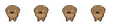

---

## Meet Clamber

Clamber is a capybara who lives on your desktop. He has needs.

| Idle | Eat | Sleep | Play |
|------|-----|-------|------|
|  | 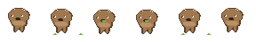 | 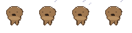 | 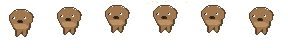 |

| Pet | Poop | React | Dead |
|-----|------|-------|------|
| 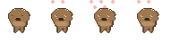 | 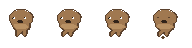 | 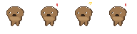 | 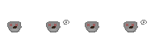 |

### Mood Expressions

His face changes based on how you treat him:

| Happy | Hungry | Sad | Dirty |
|-------|--------|-----|-------|
| 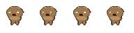 | 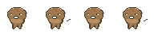 | 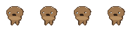 | 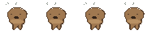 |

### Death and Rebirth

If you forget to feed Clamber for 3 days, he dies. But an egg appears — click it to hatch a new companion.

| Egg | Duck | Cat | Frog |
|-----|------|-----|------|
|  | 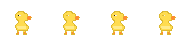 | 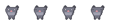 | 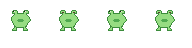 |

---

## Features

- **Always-on-top transparent window** — just the pet, no chrome
- **Pixel art sprites** — generated from code, scaled with `image-rendering: pixelated`
- **Pet simulation** — hunger, happiness, energy, cleanliness stats that decay in real time
- **Interactions** — feed, pet, play, clean via right-click menu or system tray
- **Mood faces** — expression changes based on stats (happy, hungry, sad, dirty, tired)
- **Death + rebirth** — starve for 3 days and Clamber dies; an egg hatches into a new species
- **Terminal watcher** — reacts to git commands, build errors, and test runs
- **Claude Code integration** — reacts to your conversations (frustration, celebration, greetings)
- **System tray** — toggle visibility, quick actions, quit
- **Draggable** — click and drag to move anywhere on screen

## Getting Started

### Prerequisites

- [Rust](https://rustup.rs/) (1.77+)
- [Node.js](https://nodejs.org/) (20+)
- [pnpm](https://pnpm.io/)
- Tauri CLI: `cargo install tauri-cli`

### Run in dev mode

```bash
cd app
pnpm install
pnpm tauri dev
```

### Build for release

```bash
cd app
pnpm tauri build
```

The installer will be in `app/src-tauri/target/release/bundle/`.

## Project Structure

```
buddy/
├── app/                     # Tauri app
│   ├── src/                 # Svelte frontend
│   │   ├── App.svelte       # Main pet view + state machine
│   │   └── lib/
│   │       ├── bridge.ts    # All Tauri IPC calls
│   │       ├── sprite/      # Canvas animation engine
│   │       └── ui/          # Context menu, stats, speech bubbles
│   ├── src-tauri/           # Rust backend
│   │   └── src/
│   │       ├── pet.rs       # Pet simulation (stats, decay, death)
│   │       ├── commands.rs  # Tauri commands
│   │       ├── terminal_watcher.rs  # Terminal + Claude Code watcher
│   │       └── tray.rs      # System tray
│   └── public/sprites/      # Sprite PNGs used at runtime
├── sprites/                 # Master sprite copies
└── sprite-gen/              # Node scripts that generate pixel art
```

## Stat Decay Rates

| Stat | Full to Empty | Notes |
|------|--------------|-------|
| Hunger | 3 days | Death after 5 more min at 0 |
| Happiness | ~8 days | |
| Energy | ~12 days | |

## Tech Stack

- **Tauri v2** — Rust backend + webview
- **Svelte 5** — reactive frontend
- **Sharp** — pixel art sprite generation (dev tool)
- **notify** — file system watcher for terminal monitoring
- **tauri-plugin-autostart** — launch on boot
- **tauri-plugin-store** — state persistence

---

*Don't forget to feed your buddy.*
